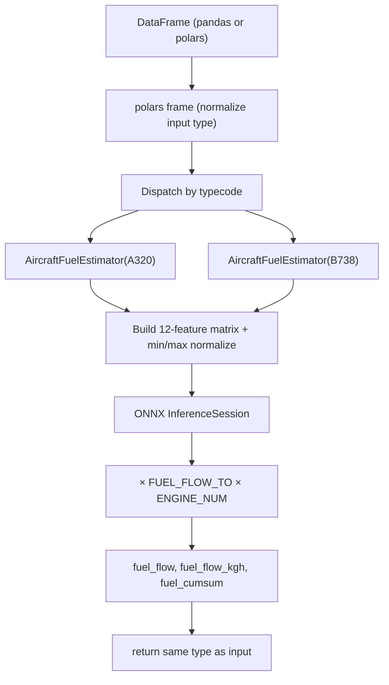

# Architecture

This page explains how Acropole turns a trajectory `DataFrame` into a fuel-flow estimate:
the polars-internal pipeline behind a pandas-compatible API, the ONNX model, feature
normalization, and the per-typecode dispatch.

## Overview



## A polars engine behind a dual API

`FuelEstimator.estimate()` accepts a **pandas or a polars** `DataFrame`. Internally the
work is always done in polars: a pandas input is converted with `pl.from_pandas`, the
estimation runs, and the result is converted back to pandas before returning. The input
type is therefore preserved on output — pandas in, pandas out; polars in, polars out.

This keeps the hot path on a single, fast columnar engine while pandas stays an
**optional** dependency (the `[pandas]` extra). Users who already live in polars pay no
conversion cost.

## Dispatch by typecode

A frame may mix several aircraft types. `estimate()` groups rows by `typecode`, and for
each group builds an `AircraftFuelEstimator` bound to that typecode via
`for_aircraft()` — which **reuses the already-loaded ONNX session and the parsed
parameters**, so adding a typecode costs only a parameter lookup, not a model reload.
Each group's predictions are scattered back into the original row order. Rows whose
typecode is unknown stay `NaN` and raise a warning.

`AircraftFuelEstimator` is also the public fast path: bound to one typecode, it works on
plain 1-D numpy arrays with all per-aircraft constants (engine scale, normalization
arrays) precomputed at construction.

## The ONNX model

The estimator runs a single ONNX `InferenceSession` on the CPU. The model takes a
`(N, 12)` matrix of features and emits one fuel-flow value per sample. The twelve
features, in order, are:

```
engine_type, d_altitude, d_groundspeed, d_airspeed, surface,
max_ope_alti, max_ope_speed, altitude, groundspeed, airspeed,
vertical_rate, mass_norm
```

Several of these (`engine_type`, `surface`, `max_ope_alti`, `max_ope_speed`) are
**per-aircraft constants** read from `aircraft_params.csv`; the rest come from the
trajectory (and its derivatives). The raw model output is the per-engine fuel flow; it is
scaled to the whole aircraft by multiplying by `FUEL_FLOW_TO × ENGINE_NUM` (the take-off
reference flow times the engine count), yielding `fuel_flow` in **kg/s**. `fuel_flow_kgh`
is that value × 3600, and `fuel_cumsum` is the running integral over the time step.

## Feature normalization

Before inference every feature is min/max-normalized into `[0, 1]` using fixed bounds —
one `(min, max)` pair per feature, baked into the package. The transform is the plain
`(x − min) / (max − min)`. The bounds encode the physical ranges the model was trained on
(e.g. altitude up to 50 000 ft, vertical rate ±5 000 ft/min). The normalized matrix is
cast to `float32` to match the model's input dtype.

## Why ONNX

Acropole originally ran a TensorFlow model. It was migrated to ONNX for two reasons:

- **No heavy ML framework** — the runtime depends only on `numpy`, `polars` and
  `onnxruntime`. There is no TensorFlow install, no GPU toolchain, no multi-hundred-MB
  dependency tree. The model ships as a single portable `.onnx` file inside the package.
- **Speed** — the ONNX path is **2–4.8× faster** than the original TensorFlow inference,
  depending on batch size, with the largest gains on small/medium batches.

The migration was validated to **numerical parity of 1e-6** against the TensorFlow
reference, so existing results are reproduced to floating-point tolerance.

## Design decisions

| Decision | Rationale |
|---|---|
| polars engine, pandas optional | One fast columnar engine; pandas stays an extra, not a core dependency |
| Same type in / same type out | Drop-in for both pandas and polars users, no surprise conversions |
| Per-typecode dispatch with shared session | Process a mixed fleet in one call without reloading the model |
| ONNX over TensorFlow | Portable single-file model, no heavy framework, 2–4.8× faster, 1e-6 parity |
| Fixed min/max normalization | Deterministic, baked-in physical ranges matching the training distribution |
| `src/` layout + `py.typed` | PEP 561 typed package, no import-shadowing, strict mypy |
